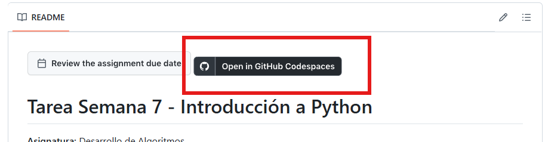

# Introducción a Git y GitHub para GitHub Classroom

## 1. ¿Qué es Git?
Git es un sistema de control de versiones distribuido que permite rastrear los cambios en los archivos de un proyecto. Es útil para trabajar en equipo, ya que facilita la colaboración y la gestión de versiones del código.

---

## 2. ¿Qué es GitHub?
GitHub es una plataforma en línea que permite almacenar repositorios de Git de forma remota. Mientras que Git se utiliza localmente en tu computadora para gestionar versiones, GitHub actúa como un servidor remoto para compartir y colaborar en proyectos.

---

## 3. ¿Qué es un repositorio?
Un repositorio es un espacio donde se almacena el historial de versiones de un proyecto. Puede estar en tu computadora (local) o en GitHub (remoto).

---
## 4. ¿Qué es GitHub Classroom y cómo funciona?
GitHub Classroom es una herramienta que permite a los profesores crear tareas y distribuirlas como repositorios individuales para cada estudiante. Los estudiantes clonan el repositorio, realizan los cambios necesarios y los suben a GitHub para entregar la tarea.

---
## 5. Flujo de trabajo básico

### Paso 1: Clonar el repositorio desde GitHub Classroom
1. Copia el enlace del repositorio proporcionado por el profesor.
2. En tu terminal, ejecuta:  
    ```bash
    git clone <URL_DEL_REPOSITORIO>
    ```

### Paso 2: Configurar nombre y correo de manera local
1. Configura tu nombre:  
    ```bash
    git config user.name "Tu Nombre"
    ```
2. Configura tu correo:  
    ```bash
    git config user.email "tu_correo@example.com"
    ```

### Paso 3: Comprobar el estado del repositorio
Ejecuta:  
```bash
git status
```
Esto te mostrará los cambios realizados en el repositorio.

### Paso 4: Agregar los archivos con `git add`
Para preparar los archivos para el commit, usa:  
```bash
git add <archivo>  # Para un archivo específico
git add .          # Para todos los archivos
```

### Paso 5: Realizar el commit con un mensaje claro
Guarda los cambios en el historial del repositorio:  
```bash
git commit -m "Descripción clara de los cambios"
```

### Paso 6: Subir los cambios a GitHub
Envía los cambios al repositorio remoto:  
```bash
git push origin main
```

---
## 6. Tabla resumen de comandos básicos de Git

| Comando      | Descripción                                   |
| ------------ | --------------------------------------------- |
| `git clone`  | Clona un repositorio remoto a tu computadora. |
| `git status` | Muestra el estado actual del repositorio.     |
| `git add`    | Prepara archivos para el commit.              |
| `git commit` | Guarda los cambios en el historial local.     |
| `git push`   | Sube los cambios al repositorio remoto.       |
| `git pull`   | Descarga cambios del repositorio remoto.      |
| `git log`    | Muestra el historial de commits.              |

---

## 7. Buenas prácticas
- Usa mensajes de commit descriptivos y claros.
- Mantén el código ordenado y bien comentado.
- No uses `--global` al configurar tu nombre y correo en los laboratorios.
- Cierra sesión en GitHub si usas un navegador público.
---

## 8. Recomendación: GitHub Codespaces

### ¿Qué es GitHub Codespaces?

GitHub Codespaces es una herramienta que permite trabajar directamente sobre el repositorio desde el navegador, en un entorno similar a Visual Studio Code, sin necesidad de instalar Git, Python ni ninguna configuración en el computador local.

**Permite:**
- Editar archivos directamente en el navegador.
- Ejecutar código en un entorno preconfigurado.
- Hacer commits y push directamente desde el navegador.

> **Importante:** En este curso, el uso de GitHub Codespaces es opcional. Puedes optar por trabajar localmente si lo prefieres. Sin embargo, se recomienda su uso para facilitar el proceso de entrega de tareas y evitar problemas de configuración en tu computadora.

### ¿Por qué usar GitHub Codespaces?

- **Facilidad de uso:** No necesitas instalar nada en tu computadora.
- **Evitar problemas de configuración:** No tendrás que preocuparte por errores de instalación o configuración de Git y Python.
- **Acceso desde cualquier lugar:** Puedes acceder a tu entorno de trabajo desde cualquier computadora con conexión a Internet.

### ¿Cómo utilizar GitHub Codespaces en GitHub Classroom?

1. Abre el repositorio de la tarea en GitHub Classroom.
2. Haz clic en el botón negro "Open in GitHub Codespaces".



3. Espera a que cargue el entorno.
4. Trabaja directamente desde el navegador: edita archivos, ejecuta código, realiza commits y push.

> Si la opción de Codespaces no está habilitada en la tarea, se debe seguir el flujo normal de trabajo local (clonación y uso en el laboratorio)
